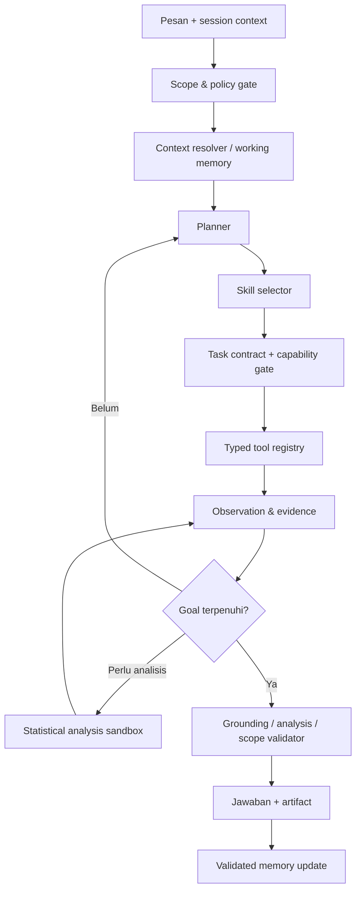

# Conversational AI Agent Runtime

## 1. Product definition

MARAWA AI adalah **domain-bounded conversational AI agent untuk statistik dan BPS**. RAG hanyalah satu tool. Sistem tidak berhenti pada pola “cari dokumen lalu jawab”, melainkan mempertahankan konteks, merencanakan langkah, menggunakan banyak tools secara berulang, melakukan analisis, membuat artefak, dan melanjutkan pekerjaan pada pertanyaan berikutnya.

## 2. Perbedaan dari chatbot/RAG biasa

| Chatbot/RAG satu langkah | MARAWA AI agent |
|---|---|
| Tiap pesan dianggap pertanyaan baru | Tiap pesan dibaca sebagai kelanjutan sesi |
| Retrieval sekali lalu generate | Plan → tool → observe → tool lagi → analyze → validate |
| Fokus FAQ/dokumen | Data lookup, analisis, metodologi, visualisasi, ekspor, layanan |
| Tidak punya active dataset/result | Menyimpan typed working memory dan artifact references |
| Follow-up sering kehilangan konteks | Coreference resolution mempertahankan indikator/wilayah/periode |
| Tidak dapat membuat hasil kerja | Dapat membuat tabel, chart, CSV/XLSX/PDF |
| Scope dijaga prompt saja | Scope gate + tool registry + source/access policy |

## 3. Agent runtime components



Komponen:

- **Scope/policy gate** — mengizinkan hanya statistik/BPS.
- **Session policy engine** — idle timeout 5 mnt (end-session notice) dan admin handover SLA 3 mnt (claim/busy/cancel); agent-first menu orientasi, bukan bot menu kaku (`27-BPS-SERVICE-MENU-FLOW.md`).
- **Context resolver** — menyelesaikan "tahun lalu", "yang tertinggi", "buat grafiknya", dan referensi lain.
- **Planner** — memilih langkah minimal untuk memenuhi tujuan.
- **Skill registry** — prosedur analisis domain yang versioned.
- **Tool registry** — akses data, RAG, analysis, chart, export, dan handover.
- **Task-contract/capability broker** — mengikat run ke allowed effects dan menerbitkan scoped authority yang tidak dapat dibuat model.
- **Provenance/taint engine** — melacak origin, data class, allowed uses, dan forbidden sinks pada tiap value.
- **Observation loop** — agent membaca hasil dan dapat mengubah rencana.
- **Validators** — memeriksa angka, lineage, comparability, language, dan scope.
- **Working memory** — state terstruktur lintas turn.
- **Artifact store** — tabel, grafik, dan ekspor yang dapat digunakan kembali.

## 4. Multi-turn session model

### Layer 1 — Transcript

Pesan user/agent/admin dan tool summary tersimpan sebagai riwayat. Untuk konteks model, gunakan recent turns + compacted summary, bukan seluruh raw history tanpa batas.

### Layer 2 — Working memory

State aktif berisi goal, indikator, geografi, periode, unit, dataset, filter, evidence/result/analysis/artifact IDs, assumptions, dan open questions.

### Layer 3 — Organizational knowledge

Corpus RAG, dataset catalog, metadata, approved skills, prompts, dan layanan BPS. Ini adalah memory organisasi, bukan memory pribadi pengguna.

### Layer 4 — Optional user preferences

Hanya preference yang benar-benar berguna dan approved, misalnya format ringkas atau wilayah yang sering dipakai. Jangan menyimpan fakta statistik sebagai user memory dan jangan membuat profiling di luar kebutuhan layanan.

## 5. Context lifecycle

- Conversation mempunyai `context_status`: `ACTIVE`, `COMPACTED`, `STALE`, `RESET`.
- Context tetap aktif pada follow-up dalam session window configurable.
- Setelah history panjang, server membuat structured compaction yang mempertahankan active references dan provenance.
- Setelah inactivity threshold 300 detik (idle, di-reset tiap inbound), server menutup sesi dengan pesan "Sesi berakhir karena tidak ada balasan selama 5 menit. Kirim pesan apa pun untuk memulai sesi baru."; transcript tetap untuk audit.
- Menu pembuka bersifat orientasi saja; user bebas menjawab dengan intent natural kapan pun (agent-first, `27-BPS-SERVICE-MENU-FLOW.md`).
- User/admin dapat meminta “mulai topik baru” untuk reset working memory tanpa menghapus transcript.
- Handover tidak otomatis menghapus context.

## 6. Agent run and step model

Satu turn pengguna menghasilkan satu `agent_run` dengan nol atau lebih `agent_steps`:

```text
run
 ├─ scope_check
 ├─ context_resolution
 ├─ skill_selection
 ├─ tool_call: search_data_catalog
 ├─ tool_call: query_stat_data
 ├─ tool_call: run_stat_analysis
 ├─ tool_call: create_visualization
 ├─ validation
 └─ response
```

Setiap step memiliki status, input/output references, timing, token/cost, dan error code. Raw internal reasoning tidak disimpan/ditampilkan; yang disimpan adalah plan summary, actions, observations terstruktur, dan provenance.

## 7. Tool families

### Discovery

- `search_data_catalog`
- `inspect_dataset`
- `search_knowledge`
- `search_bps_api`

### Data access

- `query_stat_data`
- `get_candidate_page`
- `get_result_slice`
- `join_compatible_results`

### Candidate discovery, probing, dan pagination

User tidak harus memberi indikator/wilayah/periode lengkap. `search_data_catalog` mengembalikan kandidat ter-grounding yang dikelompokkan per source, misalnya `S1` (SIMDASI), `D1` (Dynamic), `C1` (Census), dan `P1` (Publication). Ref display hanyalah alias UI ke opaque `candidate_id` dalam `candidate_set_id`; ia bukan tool permission atau identifier SQL.

Agent tetap conversational dan tidak berubah menjadi menu bot, tetapi dataset selection bersifat user-confirmed:

- untuk goal baru tanpa candidate ref/kode exact, agent selalu menampilkan kandidat sebelum fact query;
- agent boleh merekomendasikan kandidat terbaik, tetapi tidak auto-select/query kandidat itu;
- agent menampilkan 3–5 kandidat paling informatif dengan penjelasan singkat;
- user boleh memilih dengan ref, nomor, judul, atau bahasa natural;
- agent boleh menambah source/kandidat approved ketika discovery berikutnya menemukan bukti relevan;
- setelah selection, agent inspect/probing lalu query;
- valid explicit ref/kode exact dan follow-up active dataset tidak perlu candidate list ulang;
- probing menanyakan satu slot paling informatif per turn, bukan formulir berurutan;
- default hanya dipakai bila tidak mengubah makna statistik; jumlah vs persen, ADHB vs ADHK, tahunan vs triwulanan, atau sensus vs estimasi harus diklarifikasi.

Candidate pagination bersifat per source family, cursor-based, dan stabil selama candidate set aktif. Halaman berikut melanjutkan ref (`D4–D6`), bukan menomori ulang kandidat lama. `lanjut` menggunakan source group aktif; `lanjut dynamic` atau `publikasi lainnya` memilih group secara eksplisit. Working memory menyimpan candidate set, shown refs/cursors, focused group, selected candidate, dan unresolved slots. Kontrak lengkap dan temuan data live ada di `21-BPS-DATA-EXPLORATION-AND-AGENT-QUERY-DESIGN.md`.

### Analysis

- `run_stat_analysis`
- `validate_comparability`
- `explain_method`

### Artifacts

- `create_visualization`
- `create_data_export`
- `get_artifact`

### Service/workflow

- `get_service_info`
- `request_handover`
- `get_public_form_link`

Tool schema typed dan server-owned. Model memilih tools, tetapi tidak menciptakan permissions, SQL, network endpoint, atau source baru.

Setiap tool call juga memerlukan capability server-side yang terikat ke conversation, task contract, resource, purpose, data class, dan expiry. Capability bukan string rahasia di prompt; proposal model yang berisi ID palsu tidak memiliki authority.

Basis yang SUDAH di-build (15 Aug, pasca-audit): katalog = `bps_registry` (1.148 datasets, binding dimension/measure/item/geography/alias/template) + offering engine deterministik (`scripts/simulate_bps_candidate_scoring.py`); fact query = parameterized templates via `scripts/bps_template_binder.py` (semua declared param terpakai, injection/type/required ditolak, row_limit benar-benar server-side sejak fix H1, wildcard LIKE di-escape) atas allowlisted serving views melalui role `marawa_runtime_ro` yang privilegenya di-assert `scripts/check_runtime_privileges.py`. Runtime tinggal memakai fondasi ini — bukan reinventing registry/search/query.

> **Peringatan kualitas retrieval.** Angka akurasi offering engine (`Recall@3 1.000`) berasal dari set **sintetis** yang ditulis penulis scorer lalu dipakai untuk mengkalibrasi scorer itu sendiri (audit C1b/C1c, `docs/25` note A). Angka itu bukan prediksi performa terhadap pertanyaan warga. Jangan pakai untuk menetapkan threshold abstention atau confidence runtime sebelum ada set nyata di `data/evals/pst-real-questions.json`.

## 8. Statistical analysis capabilities

Minimum capabilities:

- point lookup dan filtering;
- period/region comparison;
- absolute and relative change;
- percentage-point change;
- share/composition/contribution;
- ranking/top-bottom;
- descriptive statistics;
- time-series trend and growth;
- distribution and outlier detection;
- cross-tabulation;
- correlation/association dengan caveat;
- index/rebasing bila definisi dan tool tersedia;
- chart/table generation;
- narrative summary grounded pada result.

Analysis catalog bersifat extensible melalui skills/tools. Setiap analysis menghasilkan `analysis_id`, method/version, input result IDs, parameters, output table, diagnostics, assumptions, caveats, dan reproducibility hash.

## 9. Analysis sandbox

Untuk analisis yang tidak cukup dengan operasi typed sederhana, sistem boleh memakai sandbox Python/statistik terisolasi:

- input hanya artifact/result IDs yang disetujui;
- no network;
- no host filesystem/secrets;
- ephemeral non-root container;
- allowlisted libraries;
- CPU, memory, wall-time, file-size, dan output-row limits;
- generated code dan output disimpan sebagai restricted reproducibility record;
- output melewati schema/numeric/lineage validator;
- tidak dapat mengakses source DB secara langsung.

Typed analysis operations tetap menjadi default; sandbox dipakai hanya ketika diperlukan.

## 10. Skills

Skill berisi:

- trigger/tujuan;
- prerequisite data dan metadata;
- recommended tool sequence;
- comparability checks;
- formulas/methods;
- output template;
- caveats;
- evaluation cases.

Lifecycle: `DRAFT → REVIEW → EVALUATED → ACTIVE → SUPERSEDED/QUARANTINED`. Skill tidak boleh mengubah scope atau menambah permission.

## 11. Scope enforcement

Scope tidak hanya system prompt. Empat lapis:

1. Request scope classifier/policy.
2. Domain-only skills and tools.
3. Source/dataset allowlists.
4. Output scope validator.

Scope enforcement dibungkus control/data-flow security: direct-user goal menjadi immutable `task_contract`; RAG/tool/source values tetap tainted; perubahan data-dependent hanya melalui bounded typed declassification; setiap action, memory patch, artifact, dan reply melewati capability gate. Setiap run juga dinilai dengan Agents Rule of Two: autonomous run tidak boleh sekaligus memproses untrusted input, mengakses sensitive/private data, dan mengubah state/berkomunikasi keluar.

Contoh:

- “Buat resep rendang” → out-of-scope.
- “Hitung persentase rumah tangga berdasarkan tabel BPS ini” → in-scope.
- “Jelaskan dampak pendidikan terhadap kemiskinan berdasarkan data BPS” → in-scope sebagai analisis, tetapi causal claim dibatasi.
- “Siapa calon terbaik?” → out-of-scope; agent boleh menawarkan statistik pemilu hanya jika dataset/scope approved, tanpa endorsement.

## 12. Long-running analysis

Jika analisis melampaui response budget:

1. Agent membuat `analysis_job` dan memberi acknowledgement singkat.
2. Worker menjalankan steps dengan progress status.
3. Setelah selesai, hasil/artifact disimpan.
4. Bot mengirim hasil ke conversation yang sama jika state mengizinkan.
5. Jika admin mengambil alih, automated completion ditahan untuk review/admin delivery.

## 13. Follow-up example

```text
U: Berapa jumlah penduduk Padang Pariaman tahun 2025?
A: query data 2025 → jawab + source; simpan indikator/wilayah/periode/result.

U: Bandingkan dengan tahun sebelumnya.
A: resolve “tahun sebelumnya”=2024 → query 2024 → calculate change → jawab.

U: Kecamatan mana kenaikannya paling tinggi?
A: pertahankan indikator/periode → query breakdown kecamatan → rank → jawab.

U: Kenapa bisa begitu?
A: cari metadata/narasi pendukung → jelaskan pola dan caveat kausalitas.

U: Buat grafik dan file Excel.
A: gunakan active result/analysis → create chart + XLSX → kirim artifacts.
```

## 14. Stop, retry, and budget

- Default `MAX_AGENT_STEPS=8`, configurable by task class.
- Per-tool timeout/retry classification.
- Jangan mengulang tool identik tanpa parameter/strategy change.
- Jika tool result kosong, agent boleh mencoba dataset/source alternatif yang approved.
- Jika tetap tidak cukup, abstain dan tawarkan admin/form.
- Long analysis menjadi asynchronous job, bukan melampaui time limit.

## 15. Observability

Per run ukur:

- follow-up/coreference resolution;
- plan/skill/tool selection;
- number of steps/tool errors;
- result/evidence reuse rate;
- analysis correctness;
- artifact success;
- total latency and queue time;
- model/provider/token/cost;
- stop reason;
- user feedback.

## 16. Acceptance criteria

- Pertanyaan lanjutan yang tidak mengulang indikator/wilayah/periode diselesaikan dari working memory.
- Agent dapat melakukan minimal dua tool calls berurutan ketika satu tool belum cukup.
- Agent dapat menghasilkan analisis dan grafik dari result sebelumnya.
- Semua derived analysis reproducible dan memiliki lineage.
- Agent tetap menolak topik non-statistik/BPS walau dibungkus sebagai instruksi tool.
- Context compaction tidak mengubah indikator, unit, periode, atau evidence references.
- Tainted value tidak dapat mengisi tool identity, SQL/code, source connection, destination, policy, atau permission sink.
- Tool/action tanpa valid scoped capability selalu ditolak, walaupun model, classifier, atau fallback mengusulkannya.
- Autonomous run tidak melanggar Agents Rule of Two; destination reply selalu server-bound ke conversation asal.
- User dapat meminta layanan apa pun dengan bahasa natural kapan pun; menu tidak pernah memaksa pemilihan nomor (`docs/27`).
- Tanpa inbound selama 300 detik, sesi ditutup dengan notice; antrean admin tanpa claim dalam 180 detik memunculkan busy notice + opsi batalkan (kata kunci ATAU bahasa natural) tanpa mematikan sesi.
- Cancel natural dan perpindahan layanan di tengah percakapan tidak boleh memicu error menu ("pilihan tidak valid").
