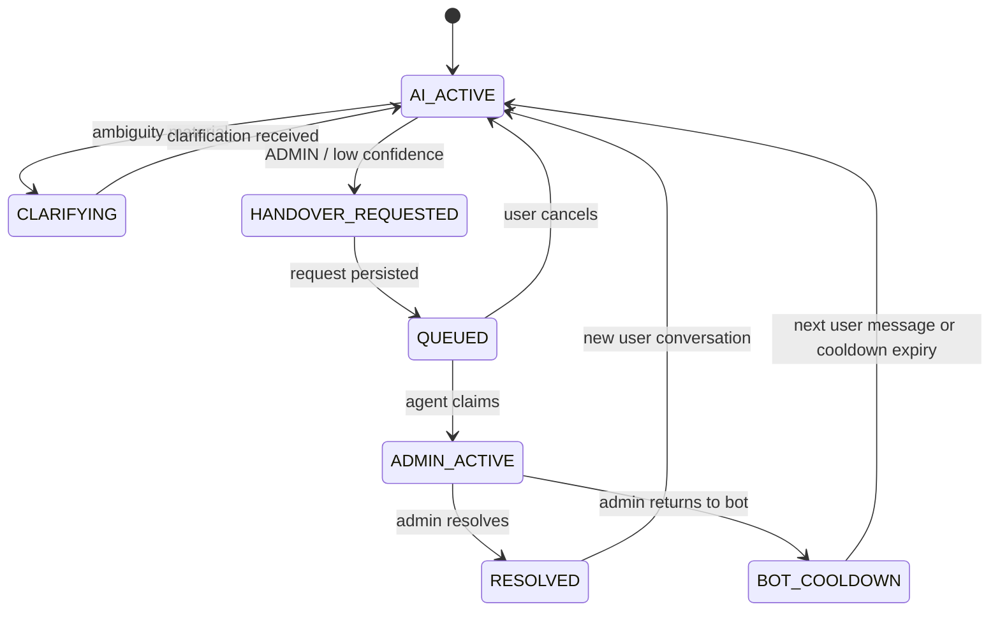

# Scope, Intent, dan Conversation Design

## 1. Domain boundary

### In-scope

- Indikator sosial, kependudukan, ekonomi, pertanian, kesejahteraan, harga, tenaga kerja, pendidikan, kesehatan, geografi, dan topik statistik lain yang tersedia pada BPS.
- Kabupaten Padang Pariaman, kecamatan/nagari bila data resmi tersedia, Sumatera Barat/nasional untuk konteks yang relevan.
- Publikasi, tabel, BRS, infografik, metadata, jadwal rilis, dan kegiatan statistik resmi.
- Layanan PST, cara mengakses data, konsultasi, rekomendasi kegiatan statistik, perpustakaan, produk statistik, alamat/kontak/jam layanan.

### Out-of-scope keras

- Informasi individu/responden dan rahasia statistik.
- Data internal yang belum disetujui untuk diseminasi.
- Angka buatan, tebakan, prediksi nonresmi, atau extrapolation tanpa metode approved.
- General assistant di luar statistik/BPS.
- Tindakan transaksi atas database sumber.

### Borderline

Pertanyaan seperti “apakah ekonomi Padang Pariaman bagus?” harus diubah menjadi pertanyaan statistik terukur: indikator apa, tahun berapa, pembanding apa. Agent boleh merangkum indikator yang tersedia, tetapi tidak memberi penilaian normatif tanpa kriteria.

## 2. Intent taxonomy

| Intent | Contoh | Action |
|---|---|---|
| `stat_query` | “Berapa TPT 2025?” | Clarify bila perlu → structured query |
| `stat_compare` | “Bandingkan penduduk 2023–2025” | Structured query + deterministic calculation |
| `definition` | “Apa itu TPT?” | Knowledge search + metadata priority |
| `publication_search` | “Cari Padang Pariaman Dalam Angka” | WebAPI/knowledge search |
| `service_info` | “Jam layanan PST?” | Approved service config/source |
| `how_to` | “Cara download data?” | Approved procedure answer |
| `handover` | “Saya mau petugas” | Request handover |
| `feedback` | “Jawaban ini salah” | Store feedback; offer admin |
| `out_of_scope` | “Buatkan resep masakan” | Scope refusal + admin/form option bila relevan |
| `abusive_noise` | Spam/tidak dapat dipahami | One concise recovery prompt, then ignore/rate-limit |

## 3. Conversation state machine



**Invariant:** tidak ada outbound message dari AI saat state `ADMIN_ACTIVE`.

## 3A. Conversational continuity

State handover di atas terpisah dari **working context** agent. Selama konteks aktif, follow-up mewarisi goal, indikator, wilayah, periode, unit, dataset, result, analysis, dan artifact sebelumnya. Referensi seperti “tahun lalu”, “bandingkan”, “yang tertinggi”, “kenapa begitu”, “buat grafiknya”, dan “ekspor ke Excel” harus diselesaikan dari context terlebih dahulu. Pengguna tidak diminta mengulang informasi yang masih jelas.

Perintah “mulai topik baru” mereset working memory, tetapi tidak menghapus transcript/audit.

## 4. Menu/greeting

```text
Halo, saya *MARAWA AI — Asisten Statistik Padang Pariaman*.

Saya dapat membantu mencari:
1. Data/indikator statistik
2. Publikasi dan tabel BPS
3. Konsep, definisi, dan metadata
4. Informasi layanan BPS
5. Chat dengan petugas

Silakan tulis kebutuhan Anda. Untuk petugas, ketik *ADMIN*.
```

Greeting tidak diulang pada setiap pesan; gunakan session inactivity threshold configurable.

## 5. Clarification policy

- Satu pertanyaan per turn.
- Prioritas slot: indikator → wilayah → periode → ukuran/unit → breakdown.
- Jangan menanyakan slot yang sudah jelas dari percakapan.
- Simpan slot state, tetapi expiry setelah inactivity threshold.
- Jika pengguna tidak menjawab dua kali, beri contoh permintaan yang benar atau tawarkan admin.

## 6. Answer policy

Jawaban statistik minimum memuat:

1. Nilai/poin utama.
2. Indikator dan definisi jika berpotensi ambigu.
3. Wilayah dan periode.
4. Unit.
5. Status/catatan penting.
6. Sumber dan tautan bila tersedia.

Untuk banyak baris, WhatsApp menampilkan maksimal N baris configurable (default 10), lalu menawarkan tautan/download; jangan mengirim tabel sangat panjang.

## 7. Confidence dan abstention

Confidence tidak berasal dari “perasaan” model. Server menghitung keputusan dari fitur:

- exact dataset/metadata match;
- reranker score dan source authority;
- coverage slot indikator-wilayah-periode-unit;
- konsistensi antar evidence;
- freshness/release status;
- output validator.

Jika gate gagal:

```text
Saya belum menemukan jawaban yang cukup kuat pada sumber statistik BPS yang tersedia. Saya tidak akan menebak.

Ketik *ADMIN* untuk chat dengan petugas, atau gunakan formulir: {PUBLIC_FORM_URL}
```

## 8. Handover copy

### Masuk antrean

```text
Permintaan Anda sudah masuk antrean petugas PST. Bot akan berhenti membalas selama petugas menangani chat ini.
```

Tambahkan estimasi hanya jika `HANDOVER_SLA_TEXT` dikonfigurasi supervisor.

### Admin mengambil alih

```text
Petugas PST telah mengambil alih percakapan ini.
```

### Kembali ke bot

```text
Percakapan dengan petugas telah selesai. MARAWA AI akan kembali membantu pada pesan Anda berikutnya. Ketik *ADMIN* kapan saja bila memerlukan petugas.
```

## 9. Feedback

Setelah jawaban tertentu, sistem boleh meminta:

```text
Apakah jawaban ini membantu? Balas *YA* atau *TIDAK*.
```

Feedback prompt di-throttle agar tidak mengganggu. `TIDAK` menyimpan reason bila pengguna menjelaskan dan menawarkan admin.

## 10. Service/form links

Semua tautan berasal dari approved configuration, bukan dibuat model:

- `OFFICIAL_WEBSITE_URL=https://padangpariamankab.bps.go.id`
- `OFFICIAL_PPID_URL=https://ppid.bps.go.id/?mfd=1306`
- `PUBLIC_FORM_URL=<diisi setelah URL form resmi disetujui>`
- `SKD_URL=https://skd.bps.go.id/skd/p/1306`

## 11. Abuse dan rate limiting

- Batasi pesan per nomor/per menit dan concurrent jobs per conversation.
- Tolak file berbahaya/unsupported sebelum ingestion.
- Jangan membalas loop dari pesan `fromMe`, status, broadcast, atau pesan bot sendiri.
- Jangan mengirim proactive message kecuali workflow resmi dan opt-in terpisah disetujui.
