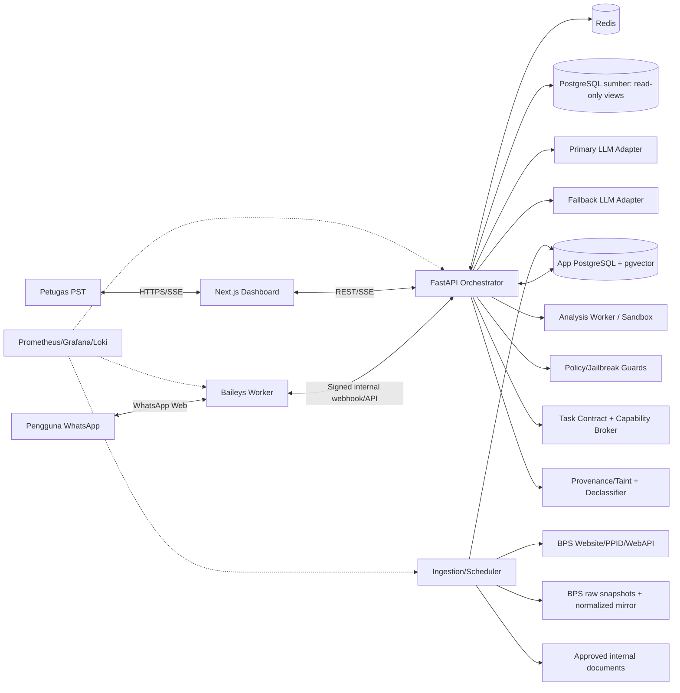
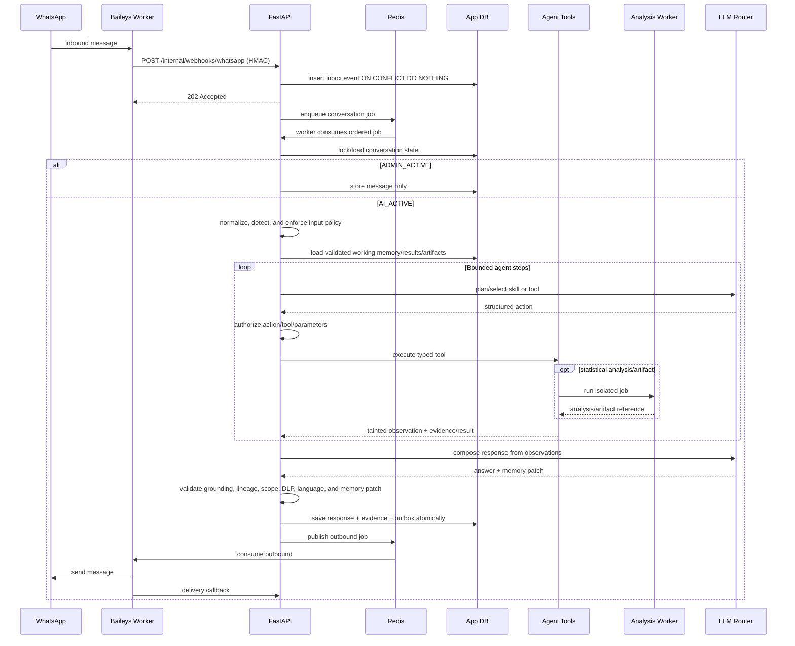

# Arsitektur Sistem MARAWA AI

## 1. Architectural drivers

- Grounded statistical accuracy dan auditability.
- Channel isolation karena Baileys adalah dependency unofficial.
- Source PostgreSQL wajib read-only.
- Human handover harus konsisten di bawah concurrency.
- Model/provider dapat diganti tanpa mengubah domain logic.
- Single-VPS simplicity untuk fase awal, tetapi komponen dipisah jelas.

## 2. Context diagram



Baileys terhubung langsung ke WhatsApp Web via WebSocket tanpa browser; karena channel ini unofficial, seluruh detail session dan protocol dibatasi pada adapter worker.[7]

## 3. Container topology

| Service | Responsibility | Network exposure |
|---|---|---|
| `caddy` | TLS, reverse proxy, headers, rate limit | Publik 80/443 |
| `dashboard` | Next.js UI/BFF minimal | Internal via Caddy |
| `api` | FastAPI orchestration, auth, API, SSE | Internal via Caddy; webhook only from worker network |
| `wa-worker` | Baileys session, inbound normalization, outbound delivery | No public port |
| `ingestion-worker` | Parse/chunk/embed/index | No public port |
| `analysis-worker` | Statistical analysis, chart, and export jobs in isolated sandbox | No public port/network egress |
| `scheduler` | BPS sync, cleanup, eval schedule | No public port |
| `app-postgres` | Operational DB + pgvector | Docker internal only |
| `redis` | Streams/queues/cache/locks | Docker internal only |
| `prometheus/grafana/loki` | Optional monitoring baseline | VPN/admin only |
| `source-postgres` | Existing BPS DB via external protected network | Read-only from `api`/ingestion as needed |

## 4. Main request sequence



## 5. Data planes

### Operational plane

Conversation, messages, session working memory, agent runs/steps, result/analysis/artifact references, outbox, user/admin, handover, prompt/model/skill releases, audit, dan feedback.

### Knowledge plane

Sources, versions, documents, chunks, embeddings, keyword index, dataset registry, evidence snapshots, ingestion jobs.

### Source plane

Existing PostgreSQL BPS dan external BPS sources. Tidak menerima write dari MARAWA AI.

### Observability plane

Metrics/log/trace dengan PII redaction dan correlation IDs.

## 6. Agent orchestration

Agent memakai bounded iterative runtime, bukan single-pass intent router dan bukan loop otonom tanpa batas:

1. Normalize message dan jalankan scope/policy pre-check.
2. Resolve conversation/handover state.
3. Load recent transcript, compacted context, working memory, active results/analysis/artifacts.
4. Resolve follow-up references dan tujuan pengguna.
5. Planner memilih statistical skill dan langkah minimum berikutnya.
6. Execute typed tool lalu masukkan observation ke run state.
7. Iterate jika hasil belum cukup, error dapat diperbaiki, atau analisis/artifact masih diperlukan.
8. Untuk pekerjaan kompleks, enqueue isolated analysis job dan lanjutkan asynchronous.
9. Compose structured answer dari evidence/result/analysis artifacts.
10. Validate grounding, derived lineage, comparability, scope, Bahasa Indonesia, dan URLs.
11. Persist response, validated memory patch, run trace, dan outbox atomically.

Default `MAX_AGENT_STEPS=8` bersifat configurable berdasarkan task class. Agent tidak boleh mengulang tool call identik tanpa perubahan parameter/strategi. Detail lengkap ada di `02-AGENT-RUNTIME.md`.

Anti-jailbreak enforcement membungkus seluruh loop: input guard sebelum context, taint guard pada RAG/tool observations, action authorization sebelum tools, memory mutation guard, sandbox isolation, output/DLP guard, dan provider-independent fallback parity. Detail lengkap ada di `09A-ANTI-JAILBREAK.md`.

Root of trust berada pada server control plane, bukan model. Direct-user goal menghasilkan immutable task contract; value dari user/source/RAG/tool/model membawa provenance/taint; data-dependent value hanya dapat dipromosikan melalui bounded typed declassification; setiap effect memerlukan scoped capability. Reply destination diikat server ke conversation origin. Research rationale ada di `09C-ANTI-JAILBREAK-RESEARCH.md`.

BPS WebAPI tidak dipanggil synchronously per chat. Scheduler/worker membangun local mirror: immutable raw snapshots → normalized current tables → read-only serving views. Exact endpoint/dependency/schema contract ada di `17-BPS-WEBAPI-DATA.md`; WhatsApp rendering contract ada di `18-WHATSAPP-DATA-ANSWER-FORMATS.md`.

## 7. Model gateway

Interface:

```text
LLMProvider.generate(messages, tools, response_schema, timeout) -> LLMResult
LLMProvider.health/capabilities() -> CapabilitySet
```

Konfigurasi:

```env
PRIMARY_PROVIDER=gemini
PRIMARY_MODEL=<provider-supported-gemini-3.1-flash-id>
FALLBACK_PROVIDER=deepseek
FALLBACK_MODEL=deepseek-v4-flash
```

Dokumentasi Google mencantumkan `gemini-3.1-flash-lite` dengan structured output dan function calling; konfigurasi tidak boleh berasumsi alias lain tersedia tanpa startup capability probe.[5] DeepSeek mendokumentasikan `deepseek-v4-flash` dan interface kompatibel yang dapat diadaptasi.[6]

Fallback matrix:

| Failure | Retry primary | Fallback | User-facing |
|---|---:|---:|---|
| Timeout/5xx | 1 bounded | Ya | Normal jika fallback sukses |
| 429 | Sesuai retry-after maksimal budget | Ya | Normal jika sukses |
| Invalid schema | 1 repair | Ya | Abstain jika dua provider gagal |
| Auth/config | Tidak | Ya jika healthy | Alert kritis |
| No evidence | Tidak | Tidak | Abstain/handover |
| Safety/policy blocked | Tidak | Tidak | Scope/policy response |

## 8. Consistency patterns

- Inbox and outbox tables implement transactional inbox/outbox.
- Unique constraint pada channel message ID.
- Conversation processing lock di Redis + DB state/version check.
- Outbound idempotency key unik.
- At-least-once queue delivery, exactly-once *effect* melalui dedup.
- Optimistic version untuk handover transitions; API menolak stale transitions.

## 9. Source query architecture

Tidak ada arbitrary SQL generation. Tool `query_stat_data` menerima:

```json
{
  "dataset_id": "population_by_district_year",
  "filters": {"year": 2025, "district_code": "..."},
  "dimensions": ["district"],
  "measures": ["population"],
  "limit": 20
}
```

Server memvalidasi schema dataset, mengompilasi parameterized SQL terhadap allowlisted view, menetapkan transaction read-only, timeout, row limit, dan menyimpan normalized result + evidence.

## 10. Scalability path

- MVP: satu replica tiap service, Redis Streams, one app DB.
- Scale vertical lebih dulu.
- Scale horizontal API/ingestion setelah session ownership dan locks teruji.
- `wa-worker` satu active owner per WhatsApp account; standby/manual recovery untuk MVP.
- Jika pindah ke official WhatsApp API, implementasi channel adapter baru tanpa mengubah conversation/agent domain.

## 11. Failure behavior

- Provider down: fallback/circuit breaker.
- Source DB down: document RAG tetap tersedia; structured query abstains.
- Redis down: webhook disimpan di DB inbox dan scheduler replays pending.
- App DB down: worker tidak ack internal webhook sebagai accepted; Baileys retry buffer bounded, alert.
- WhatsApp disconnected: queue outbound tetap pending; reconnect and drain dengan TTL.
- Stale source: jawab hanya bila masih valid dan tampilkan period; alert knowledge manager.

## Sources

[5] https://docs.cloud.google.com/gemini-enterprise-agent-platform/models/gemini/3-1-flash-lite — Gemini 3.1 Flash-Lite
[6] https://api-docs.deepseek.com/updates — DeepSeek API Change Log
[7] https://baileys.wiki — Baileys Documentation
