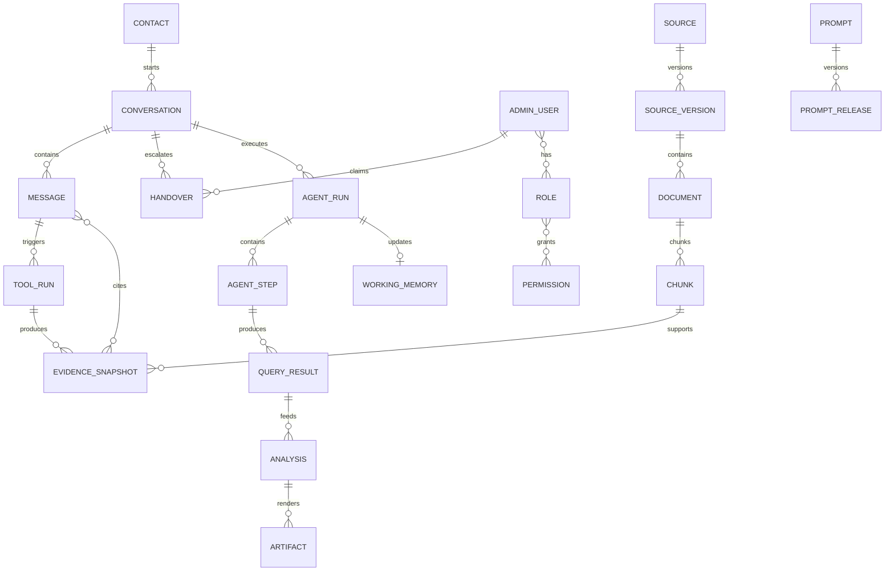

# Database Design

## 1. Pemisahan database

MARAWA AI menggunakan dua logical database yang berbeda:

1. **Source PostgreSQL existing** — milik sistem internal BPS; MARAWA hanya membaca approved views melalui role `marawa_source_ro`.
2. **Application PostgreSQL + pgvector** — milik MARAWA; menyimpan conversation, admin, audit, outbox, knowledge index, embeddings, evidence, config releases, dan analytics facts.
3. **BPS WebAPI mirror schemas** — logical area di application PostgreSQL untuk immutable raw snapshots, ingestion runs/checkpoints, normalized current data, serving views, dan publication-file manifests. Ingestion role menulis; public agent role hanya membaca allowlisted serving views.
4. **`bps_registry`** — built 2026-08-15: dataset/measure/dimension/item/geography/alias/query-template registry + candidate sets; ditulis hanya oleh registry builder saat publish version, dibaca runtime read-only.

Kredensial, role, network policy, backup, dan migration kedua database tidak boleh dicampur.

## 2. Source PostgreSQL controls

### Role baseline

```sql
CREATE ROLE marawa_source_ro LOGIN PASSWORD '<managed-outside-sql>';
ALTER ROLE marawa_source_ro SET default_transaction_read_only = on;
ALTER ROLE marawa_source_ro SET statement_timeout = '5s';
ALTER ROLE marawa_source_ro SET idle_in_transaction_session_timeout = '10s';
REVOKE ALL ON SCHEMA public FROM marawa_source_ro;
GRANT USAGE ON SCHEMA marawa_public TO marawa_source_ro;
GRANT SELECT ON ALL TABLES IN SCHEMA marawa_public TO marawa_source_ro;
ALTER DEFAULT PRIVILEGES IN SCHEMA marawa_public
  GRANT SELECT ON TABLES TO marawa_source_ro;
```

`marawa_public` sebaiknya hanya berisi views yang secara eksplisit diizinkan untuk MARAWA AI agent. Role tidak mendapat akses base tables, system catalog beyond defaults, function execution tambahan, DDL, atau DML.

### View contract

Setiap view harus memiliki:

- stable column names dan types;
- `indicator_code`, `indicator_name`, `geography_code/name`, `period`, `value`, `unit` bila sesuai;
- publication/source metadata;
- release status dan `released_at`;
- tidak memuat identifier individu atau data belum rilis;
- owner dan data dictionary.

## 3. Application schema domains

```text
identity     admin_users, roles, permissions, sessions, totp_secrets
conversation contacts, conversations, messages, handovers, assignments, notes
reliability  inbox_events, outbox_messages, delivery_events, dead_letters
knowledge    sources, source_versions, documents, chunks, embeddings, datasets
agent        prompts, prompt_releases, model_configs, skills, skill_releases, agent_runs, agent_steps
analysis     query_results, analyses, analysis_jobs, artifacts, evidence_snapshots
quality      feedback, evaluations, eval_cases, content_gaps
security     audit_events, security_events, api_keys
bps_mirror   ingestion_runs, raw_snapshots, checkpoints, dynamic/census/simdasi/publication/glossary tables
```

## 4. Core ER diagram



## 5. Key tables

### `contacts`

| Column | Type | Notes |
|---|---|---|
| `id` | uuid | PK |
| `channel` | text | `whatsapp` |
| `channel_subject_hash` | text | HMAC/search-safe identity |
| `encrypted_channel_subject` | bytea | Nomor/JID encrypted at application layer |
| `display_name` | text nullable | PII; access controlled |
| `first_seen_at`, `last_seen_at` | timestamptz | UTC |
| `blocked_at` | timestamptz nullable | Abuse/admin action |

Unique `(channel, channel_subject_hash)`.

### `conversations`

| Column | Type | Notes |
|---|---|---|
| `id` | uuid | PK |
| `contact_id` | uuid | FK |
| `state` | enum | `AI_ACTIVE`, `CLARIFYING`, `QUEUED`, `ADMIN_ACTIVE`, `BOT_COOLDOWN`, `RESOLVED` |
| `assigned_admin_id` | uuid nullable | FK |
| `priority` | smallint | default 0 |
| `version` | bigint | optimistic concurrency |
| `last_message_at` | timestamptz | queue sorting |
| `bot_paused_until` | timestamptz nullable | cooldown |
| `created_at`, `updated_at`, `resolved_at` | timestamptz | |

Partial indexes untuk active queue dan assigned admin.

### `messages`

| Column | Type | Notes |
|---|---|---|
| `id` | uuid | PK |
| `conversation_id` | uuid | FK |
| `direction` | enum | inbound/outbound/internal |
| `author_type` | enum | user/ai/admin/system |
| `channel_message_id` | text nullable | Unique per channel/account |
| `body_ciphertext` | bytea | Message content encrypted |
| `body_redacted` | text nullable | Redacted preview/search optional |
| `status` | enum | received/processing/queued/sent/delivered/read/failed |
| `intent` | text nullable | |
| `prompt_release_id`, `model_config_id` | uuid nullable | lineage |
| `metadata` | jsonb | bounded/schema-validated |
| `created_at` | timestamptz | |

### Inbox/outbox

`inbox_events` unique `(source, external_event_id)`; `outbox_messages` unique `idempotency_key`. Outbox row dan outbound `messages` dibuat dalam transaction yang sama. Worker memakai `FOR UPDATE SKIP LOCKED` atau Redis stream consumer group dan mengubah status secara idempotent.

### Knowledge

- `sources`: connector, canonical URL/path, authority, owner, access class.
- `source_versions`: checksum, fetched/released/effective timestamps, status, parser version.
- `documents`: normalized metadata and extracted text pointer.
- `chunks`: text, page/section/table metadata, `tsvector`, token count.
- `chunk_embeddings`: `(chunk_id, embedding_model_id, vector)`; unique per model.
- `datasets`: tool schema, SQL template/view, dimensions/measures, citation template.

### BPS WebAPI mirror

- `bps_ingestion_runs`, `bps_raw_snapshots`, `bps_ingestion_checkpoints` — execution, immutable API history, dan resumability.
- `bps_dynamic_*` — subjects, variables, dimensions, concatenated-key facts.
- `bps_census_*` — events, topics, areas, datasets, category-aware facts.
- `bps_simdasi_*` — MFD regions, subjects, tables, table-year raw details.
- `bps_publications`, `bps_publication_files` — metadata/detail and verified binary manifest.
- `bps_glossary` — normalized definitions plus original `_source` hit.
- `bps_serving_*` — stable read-only projections untuk typed agent tools.

External IDs dan MFD codes menggunakan `text`; unknown response fields tetap di `raw jsonb`. `NULL`, `0`, dash, dan ellipsis memiliki makna berbeda. Full contract: `17-BPS-WEBAPI-DATA.md`.

### Evidence

`evidence_snapshots` menyimpan immutable subset yang benar-benar dipakai: source/version/chunk/result, quoted text atau normalized rows, period, geography, unit, URL, hash, dan creation time. Jawaban lama tetap dapat diaudit setelah source di-reindex.

### Agent sessions/runs

- `conversation_contexts`: context status, compacted summary, active goal/topic, version.
- `working_memories`: validated JSON state berisi active indicators/geographies/periods/units/dataset IDs dan references; satu active version per conversation.
- `agent_runs`: satu user turn, task class, model/provider, prompt/skill releases, status, stop reason, step/token/cost/latency totals.
- `agent_steps`: ordered scope/context/plan/tool/analysis/validation steps dengan typed input/output references; tidak menyimpan chain-of-thought.
- `tool_runs`: tool name/version, validated parameters, result/error reference, timing.

### Results, analyses, artifacts

- `query_results`: immutable normalized data, schema, dataset/source/evidence IDs, filters, checksum, row count, expiry/access class.
- `analyses`: method/version, input result IDs, parameters, output result/table, diagnostics, assumptions, caveats, reproducibility hash.
- `analysis_jobs`: asynchronous status/progress, resource budget, retry/error.
- `artifacts`: type (`chart`, `table`, `csv`, `xlsx`, `pdf`), render spec, storage pointer, checksum, source result/analysis IDs, access/expiry.
- `skills`/`skill_releases`: trigger, procedure, tool requirements, validators, lifecycle, evaluation report.

Working memory hanya menyimpan opaque references ke hasil di atas, bukan salinan angka tanpa provenance.

### Identity/RBAC

- Password hanya Argon2id hash.
- TOTP secret encrypted; recovery codes hashed dan one-time.
- Refresh/session tokens hashed, rotatable, revocable.
- Permission mapping disimpan di DB tetapi server punya known-permission registry agar typo tidak silently grant.

### Audit

`audit_events` append-only:

```json
{
  "actor_type": "admin|system",
  "actor_id": "...",
  "action": "handover.claim",
  "resource_type": "conversation",
  "resource_id": "...",
  "request_id": "...",
  "ip_hash": "...",
  "before": {},
  "after": {},
  "occurred_at": "..."
}
```

Body chat/secrets tidak disalin ke audit payload.

## 6. Example DDL: event idempotency

```sql
CREATE TABLE inbox_events (
  id uuid PRIMARY KEY,
  source text NOT NULL,
  external_event_id text NOT NULL,
  event_type text NOT NULL,
  payload jsonb NOT NULL,
  payload_sha256 text NOT NULL,
  received_at timestamptz NOT NULL DEFAULT now(),
  processed_at timestamptz,
  failure_count integer NOT NULL DEFAULT 0,
  last_error_code text,
  UNIQUE (source, external_event_id)
);

CREATE TABLE outbox_messages (
  id uuid PRIMARY KEY,
  conversation_id uuid NOT NULL REFERENCES conversations(id),
  idempotency_key text NOT NULL UNIQUE,
  channel text NOT NULL,
  destination_ciphertext bytea NOT NULL,
  payload jsonb NOT NULL,
  status text NOT NULL DEFAULT 'pending',
  attempt_count integer NOT NULL DEFAULT 0,
  available_at timestamptz NOT NULL DEFAULT now(),
  sent_at timestamptz,
  last_error_code text,
  created_at timestamptz NOT NULL DEFAULT now()
);
```

## 7. State transition transaction

Claim admin harus atomic:

```sql
UPDATE conversations
SET state = 'ADMIN_ACTIVE',
    assigned_admin_id = :admin_id,
    version = version + 1,
    updated_at = now()
WHERE id = :conversation_id
  AND version = :expected_version
  AND state IN ('QUEUED', 'HANDOVER_REQUESTED')
RETURNING *;
```

Jika tidak ada row, API mengembalikan conflict; tidak boleh force claim diam-diam.

## 8. Retention and partitioning

Keputusan produk: chat disimpan tanpa batas waktu untuk analitik. Implementasi harus:

- memisahkan PII-encrypted operational store dari derived pseudonymous analytics;
- partition `messages`, `audit_events`, dan `delivery_events` per bulan/kuartal;
- mendukung export, legal hold, correction, dan deletion/anonymization workflow setelah policy final;
- menjalankan periodic access review dan key rotation;
- tidak mengartikan “tanpa batas” sebagai backup/log/cache tanpa lifecycle.

## 9. Migration rules

- Alembic untuk app DB; source DB view changes dikelola owner source dengan contract tests.
- Migration expand/contract untuk zero/low downtime.
- Tidak drop column/table dalam release yang sama dengan removal code.
- Backup sebelum destructive migration; test restore, bukan hanya backup creation.
- Pgvector dimension change membutuhkan tabel/index baru dan re-embedding, bukan in-place assumption.
